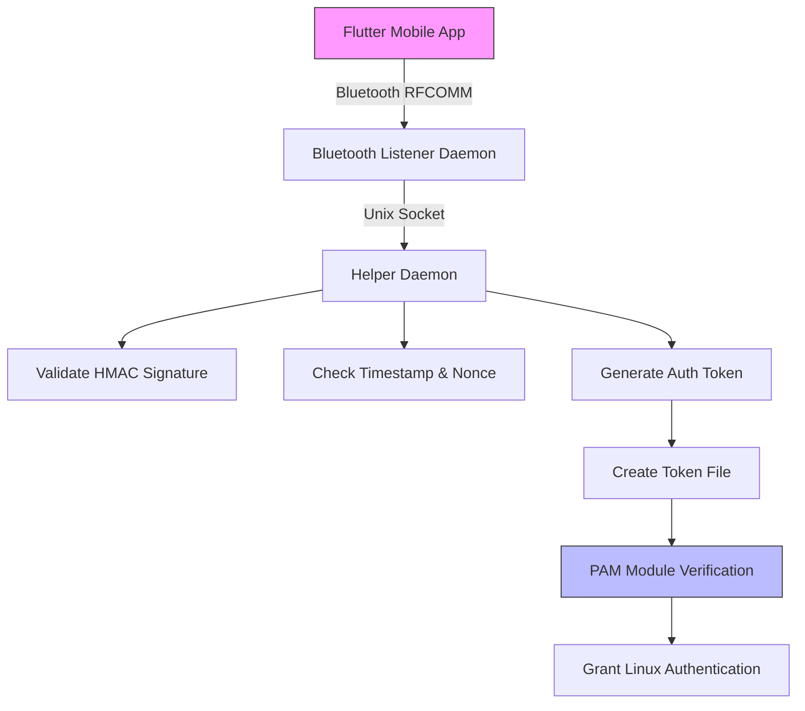

# TapIn - Passwordless Authentication System

**A comprehensive passwordless authentication system using Bluetooth and mobile device fingerprint verification**

## Overview

TapIn is a secure authentication system that enables passwordless login to Linux systems using a mobile device with Bluetooth and fingerprint capabilities. The system consists of a Flutter mobile app that communicates with Linux daemons to authenticate users without requiring traditional passwords.

## Security Improvements

### Critical Fixes Applied

1. **Mobile App Security Enhancement**
   - **Removed default shared secret**: The mobile app no longer falls back to a default secret, preventing universal authentication keys
   - **Added shared secret validation**: App now requires proper configuration of the shared secret before allowing authentication
   - **Improved error handling**: Better error handling for shared secret configuration issues

2. **Bluetooth Security Enhancement**
   - **Device verification**: Added verification to ensure only paired/trusted devices can connect to the Bluetooth daemon
   - **Command injection protection**: Implemented proper input sanitization in device verification commands

3. **Helper Daemon Security Improvements**
   - **Timing attack prevention**: Implemented constant-time comparison for HMAC validation
   - **Secure random token generation**: Replaced weak `rand()` with `/dev/urandom` for cryptographically secure tokens
   - **Secure socket permissions**: Changed Unix socket permissions from 0666 to 0600

4. **PAM Module Security Improvements**
   - **Race condition prevention**: Implemented file locking to prevent token reuse in concurrent authentication attempts
   - **Atomic operations**: Added proper locking mechanisms to ensure tokens are read and deleted atomically

## Architecture



## Components

### 1. Mobile App (Flutter)
- Bluetooth scanning and connection
- Fingerprint authentication
- Secure credential storage
- HMAC signature generation
- Authentication request transmission

### 2. Bluetooth Daemon
- Listens for RFCOMM connections
- Validates JSON authentication requests
- Verifies paired/trusted devices
- Communicates with helper daemon via Unix socket

### 3. Helper Daemon
- Validates HMAC signatures using constant-time comparison
- Checks timestamps and nonces
- Creates temporary authentication tokens using secure random generation
- Manages token security

### 4. PAM Module
- Reads authentication tokens with file locking
- Validates token expiration
- Authenticates users for login
- Implements one-time token usage with atomic operations

## Security Features

### Cryptographic Security
- **HMAC Validation**: All requests are signed with HMAC-SHA256 using secure constant-time comparison
- **Timestamp Checking**: Prevents delayed replay attacks with 30-second window
- **Nonce Verification**: Prevents immediate replay attacks
- **Token Expiration**: Tokens expire after 20 seconds
- **One-Time Use**: Tokens are consumed after single use with atomic read-delete

### Device Security
- **Paired Device Verification**: Only pre-paired Bluetooth devices are accepted
- **Bluetooth Encryption**: Communication uses Bluetooth security protocols
- **Authentication Requests**: Signed to prevent spoofing

### Token Security
- **Secure Storage**: Tokens stored with proper file permissions (0600)
- **Race Condition Prevention**: File locking prevents concurrent access issues
- **Atomic Operations**: Read and delete operations are properly synchronized

## Installation

### Prerequisites
- Linux system with PAM support
- Bluetooth adapter (USB or built-in)
- Root access for installation

### Quick Installation

```bash
cd /path/to/TapIn/TapIn_PAM
./scripts/installer.sh
```

### Configuration

1. Generate a strong shared secret:
```bash
sudo openssl rand -hex 32 > /etc/tapin/shared_secret
sudo chmod 600 /etc/tapin/shared_secret
```

2. Configure the same shared secret in the Flutter app

## Usage

### Service Management

```bash
# Check service status
sudo systemctl status tapin-helper.service tapin-bluetooth.service

# View logs
sudo journalctl -u tapin-helper.service -f
sudo journalctl -u tapin-bluetooth.service -f

# Restart services
sudo systemctl restart tapin-helper.service tapin-bluetooth.service
```

### Authentication Flow

1. Open TapIn Flutter app on mobile device
2. Authenticate with fingerprint
3. App sends signed authentication request via Bluetooth
4. Linux system validates request and creates temporary token
5. PAM module uses token to authenticate user
6. User is logged in without password

## Uninstall

```bash
sudo ./scripts/installer.sh --uninstall
```

## Rollback

If needed, rollback to previous state:
```bash
sudo ./scripts/installer.sh --rollback
```

## Development

### Building from Source

```bash
cd /path/to/TapIn/TapIn_PAM
make clean
make
```

## Troubleshooting

### Common Issues

1. **Bluetooth connection fails**:
   - Check: `sudo systemctl status bluetooth`
   - Verify device pairing

2. **PAM authentication doesn't work**:
   - Check daemon status: `sudo systemctl status tapin-*`
   - Review PAM configuration

3. **Services won't start**:
   - Check logs: `sudo journalctl -u tapin-* -f`
   - Verify dependencies

### Debugging

Enable detailed logging by checking system logs:
```bash
sudo journalctl -u tapin-helper.service -f
sudo journalctl -u tapin-bluetooth.service -f
```