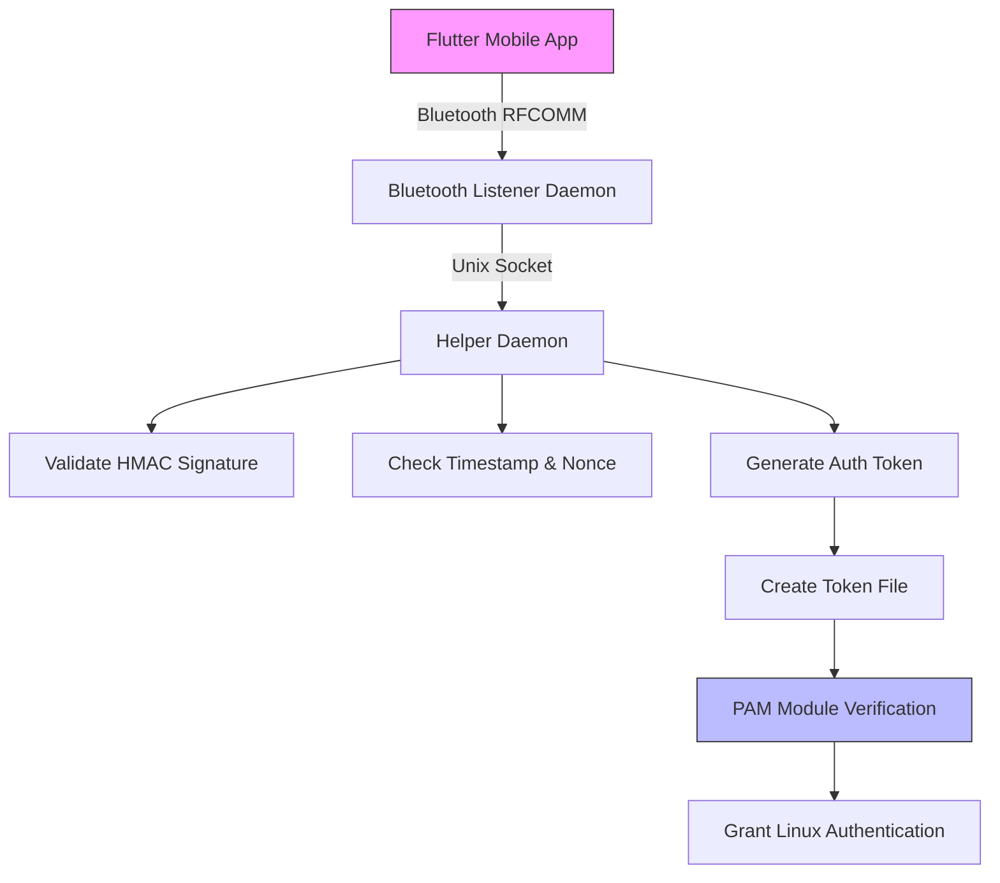

# TapIn PAM Authentication System

**Passwordless Linux authentication using Bluetooth and mobile device fingerprint verification**

## Overview

TapIn is a comprehensive authentication system that enables passwordless login to Linux systems using a mobile device with Bluetooth and fingerprint capabilities. The system consists of a Flutter mobile app that communicates with Linux daemons to authenticate users without requiring traditional passwords.

## Features

- **Passwordless Authentication**: Authenticate using fingerprint on your mobile device
- **Bluetooth Communication**: Secure communication via RFCOMM Bluetooth protocol
- **HMAC Validation**: Cryptographic validation of authentication requests
- **PAM Integration**: Seamless integration with Linux PAM system
- **Cross-Distribution Compatible**: Works on major Linux distributions
- **Safe Installation**: Comprehensive installer with rollback capability
- **Secure Token System**: Temporary tokens with expiration and single-use policy

## Architecture



## Components

### 1. Mobile App (Flutter)
- Bluetooth scanning and connection
- Fingerprint authentication
- Secure credential storage
- HMAC signature generation
- Authentication request transmission

### 2. Bluetooth Daemon
- Listens for RFCOMM connections
- Validates JSON authentication requests
- Communicates with helper daemon via Unix socket
- Provides Bluetooth acknowledgment

### 3. Helper Daemon
- Validates HMAC signatures
- Checks timestamps and nonces
- Creates temporary authentication tokens
- Manages token security

### 4. PAM Module
- Reads authentication tokens
- Validates token expiration
- Authenticates users for login
- Implements one-time token usage

## Installation

### Prerequisites
- Linux system with PAM support
- Bluetooth adapter (USB or built-in)
- Root access for installation

### Quick Installation

```bash
cd /path/to/Tap-In/TapIn_PAM
./scripts/installer.sh
```

For detailed installation instructions, see [INSTALL.md](INSTALL.md).

### Supported Distributions

- Ubuntu 20.04+ / Debian 11+
- Fedora 35+ / RHEL / CentOS / Rocky Linux / AlmaLinux
- openSUSE / SLES
- Arch Linux / Manjaro

For full compatibility details, see [COMPATIBILITY.md](COMPATIBILITY.md).

## Configuration

### PAM Integration

Add to your PAM configuration files (e.g., `/etc/pam.d/login`):
```
auth sufficient pam_tapin.so
```

### Mobile App Setup

1. Pair your mobile device with the Linux system via Bluetooth
2. Configure the same shared secret in the Flutter app
3. Save your Linux credentials in the app
4. Use fingerprint authentication to login

## Security Features

- **HMAC-SHA256 Validation**: Cryptographic verification of authentication requests
- **Timestamp Validation**: Prevention of replay attacks
- **Token Expiration**: Tokens expire after 20 seconds
- **One-Time Use**: Tokens are consumed after single use
- **Proper Permissions**: Secure file permissions on sensitive files
- **Input Validation**: Protection against injection attacks

## Usage

### Service Management

```bash
# Check service status
sudo systemctl status tapin-helper.service tapin-bluetooth.service

# View logs
sudo journalctl -u tapin-helper.service -f
sudo journalctl -u tapin-bluetooth.service -f

# Restart services
sudo systemctl restart tapin-helper.service tapin-bluetooth.service
```

### Authentication Flow

1. Open TapIn Flutter app on mobile device
2. Authenticate with fingerprint
3. App sends signed authentication request via Bluetooth
4. Linux system validates request and creates temporary token
5. PAM module uses token to authenticate user
6. User is logged in without password

## Uninstall

```bash
sudo ./scripts/installer.sh --uninstall
```

## Rollback

If needed, rollback to previous state:
```bash
sudo ./scripts/installer.sh --rollback
```

## Troubleshooting

### Common Issues

1. **Bluetooth connection fails**:
   - Check: `sudo systemctl status bluetooth`
   - Verify device pairing

2. **PAM authentication doesn't work**:
   - Check daemon status: `sudo systemctl status tapin-*`
   - Review PAM configuration

3. **Services won't start**:
   - Check logs: `sudo journalctl -u tapin-* -f`
   - Verify dependencies

### Debugging

Enable detailed logging by checking system logs:
```bash
sudo journalctl -u tapin-helper.service -f
sudo journalctl -u tapin-bluetooth.service -f
```

## Development

### Building from Source

```bash
cd /path/to/Tap-In/TapIn_PAM
make clean
make
```

### Testing

The system includes comprehensive error handling and validation. All components log to syslog for debugging.

## Security Considerations

- The shared secret must be kept secure and identical on both systems
- Only paired/trusted Bluetooth devices should be allowed to connect
- Regular security updates should be applied to the system
- Monitor authentication logs for suspicious activity

## Contributing

Contributions are welcome! Please follow the existing code style and include appropriate tests.

## License

This project is licensed under the terms specified in the project's license file.

## Support

For support, please check the logs and verify all installation steps were completed successfully. If you encounter issues, check the system logs and ensure all dependencies are properly installed.

---

**Note**: This system is designed for convenience and security. Always consider your specific security requirements before deploying in production environments.